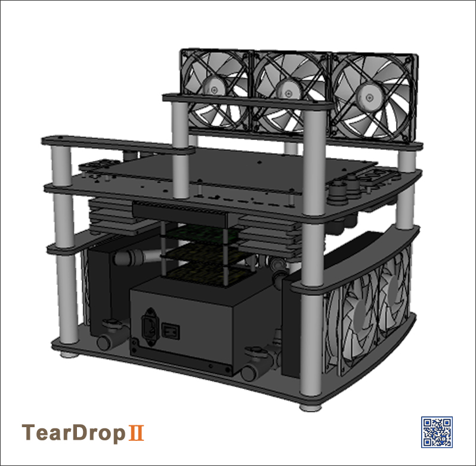

#TearDrop App

##Table of Contents

* [Screenshots](#screenshots)
* [About the Project](#about-the-project)
* [TearDrop App](#teardrop-app)
* [License](#license)

##Screenshots

<table>
	<tr>
		<td align="center" width="200px">
			
		</td>
		<td align="center" width="200px">
			
		</td>
		<td align="center" width="200px">
			
		</td>
		<td align="center" width="200px">
			
		</td>
	</tr>
	<tr>
		<td align="center" width="200px">
			
		</td>
		<td align="center" width="200px">
			
		</td>

	</tr>
</table>

##About the Project
 
__TearDrop__ is a custom, open-frame, water-cooled scratch build I’ve been working on 
in my spare time for the past three years.
 
The driving force behind this project is to design, prototype & create everything for 
a fully functional computer that will be powerful, aesthetically pleasing, and 
most importantly, completely unique.
 
In this process, I’ve learned how to program micro-controllers, design, prototype & 
build electronic circuit boards, make CNC cutting templates, creare front-end applications,
and lots more.

This project also helped me to become proficient in multiple software tools, including: 
[Google Sketchup](http://www.sketchup.com/), 
[Arduino IDE](http://www.arduino.cc/), [Processing 2.0](http://processing.org/), 
[CadSoft Eagle](http://www.cadsoftusa.com/download-eagle/freeware/), 
and [Inkscape](http://www.inkscape.org/en/).
 
The __project-log__ of this build (which I haven't had time to update recently, but 
does include loads of cool pictures :-), can be found 
on [bit-tech](http://forums.bit-tech.net/showthread.php?t=234218).
 

##TearDrop App

__TearDrop App__ is the front-end interface for communicating with TearDrop's 
[Pump Controller](https://github.com/nadavmatalon/TearDrop_Pump_Controller) 
and [Fan Controller](https://github.com/nadavmatalon/TearDrop_Fan_Controller).

It was created with [Processing 2.0](http://processing.org/)

This repo contains the source code for the __Windows 7__ version of the app 
(fully tested) and __Mac OS X__ (not tested yet).

The source code can accessed directly by clicking this link:

* [TearDrop App (Windows 7)](TearDrop_App_Win/TearDrop_App/TearDrop_App.pde)

* [TearDrop App (Mac OS X)](TearDrop_App_Mac/TearDrop_App_Mac.pde)

Note that in order to run the code in [Processing 2.0 IDE](http://processing.org/), 
Java must be installed and the `data` sub-folder must be included.

Due to size limitations, it was not possible to include the standalone version of the app
in this repo. However, if you would like to create it yourself, follow these simple steps:

* Copy the source code file (*.pde) of either the __Windows 7__ or __Mac OS X__ version 
  for the app into a local folder.
* Copy the data sub-folder and place it inside the local folder.
* Open the source code in the [Processing 2.0 IDE](http://processing.org/)
* Click on `file>Export Application` and choose the relevant platform.
* A new sub-folder should be creatd inside your local folder containing the standalone app.

##  License

Released under the <a href="http://www.opensource.org/licenses/MIT">MIT license</a>.

