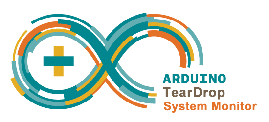

#TearDrop App

##Table of Contents

* [Screenshots](#screenshots)
* [General Description](#general-description)
* [License](#license)

##Screenshots

<table>
	<tr>
		<td align="center" width="200px">
			
		</td>
		<td align="center" width="200px">
			
		</td>
		<td align="center" width="200px">
			
		</td>
		<td align="center" width="200px">
			
		</td>
	</tr>
	<tr>
		<td align="center" width="200px">
			
		</td>
		<td align="center" width="200px">
			
		</td>

	</tr>
</table>

##General Description
 
__TearDrop App__ is the front-end interface for communicating with TearDrop's 
[Pump Controller](https://github.com/nadavmatalon/TearDrop_Pump_Controller) 
and [Fan Controller](https://github.com/nadavmatalon/TearDrop_Fan_Controller).

It was written with [Processing 2.0](http://processing.org/)

This repo contains the source code for the __Windows 7__ version of the app 
(fully tested) and __Mac OS X__ (not tested).

The source code can accessed directly by clicking this link:

* [TearDrop App (Windows 7)](TearDrop_App_Win/TearDrop_App/TearDrop_App.pde)

* [TearDrop App (Mac OS X)](TearDrop_App_Mac/TearDrop_App_Mac.pde)

Note that in order to run the code in [Processing 2.0 IDE](http://processing.org/), 
the `data` sub-folder must be included.

Due to size limitation it was not possible to include the standalone version of the app
in this repo. However, if you would like to create it yourself, follow these simple steps:

* Copy the source code file (*.pde) of either the __Windows 7__ or __Mac OS X__ version 
  for the app into a local folder.
* Copy the data sub-folder and place it inside the local folder.
* Open the source code in the [Processing 2.0 IDE](http://processing.org/)
* Click on `file>Export Application` and choose the relevant platform.
* A new sub-folder should be creatd inside your local folder containing the standalone app.

##  License

Released under the <a href="http://www.opensource.org/licenses/MIT">MIT license</a>.

